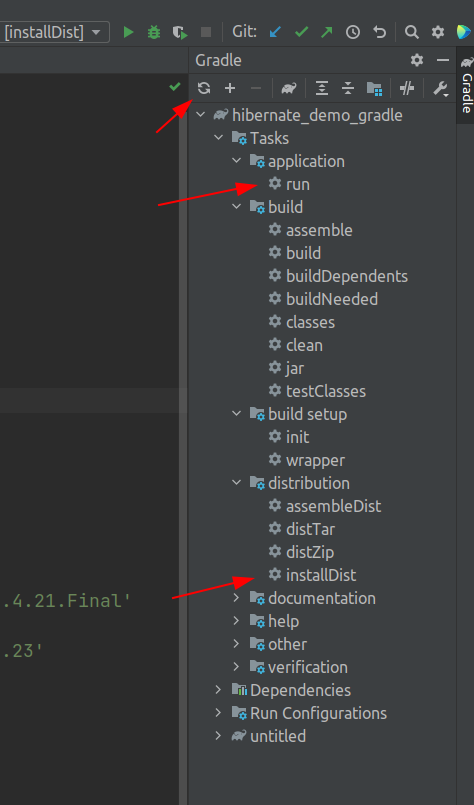

# hibernate_demo_gradle
Пример приложения с Hibernate для IntelliJ IDEA на Java (сборщик GRADLE)

https://mvnrepository.com

build.gradle
```
plugins {
    id 'application'
}


application {
    mainClass = 'kz.proffix4.hibernate.Launch'
}


group 'kz.proffix4'
version '1.0-SNAPSHOT'

repositories {
    mavenCentral()
}

dependencies {
    testImplementation 'org.junit.jupiter:junit-jupiter-api:5.7.0'
    testRuntimeOnly 'org.junit.jupiter:junit-jupiter-engine:5.7.0'
    // https://mvnrepository.com/artifact/org.hibernate/hibernate-core
    implementation group: 'org.hibernate', name: 'hibernate-core', version: '5.4.21.Final'
    // https://mvnrepository.com/artifact/mysql/mysql-connector-java
    implementation group: 'mysql', name: 'mysql-connector-java', version: '8.0.23'
}

test {
    useJUnitPlatform()
}
```


